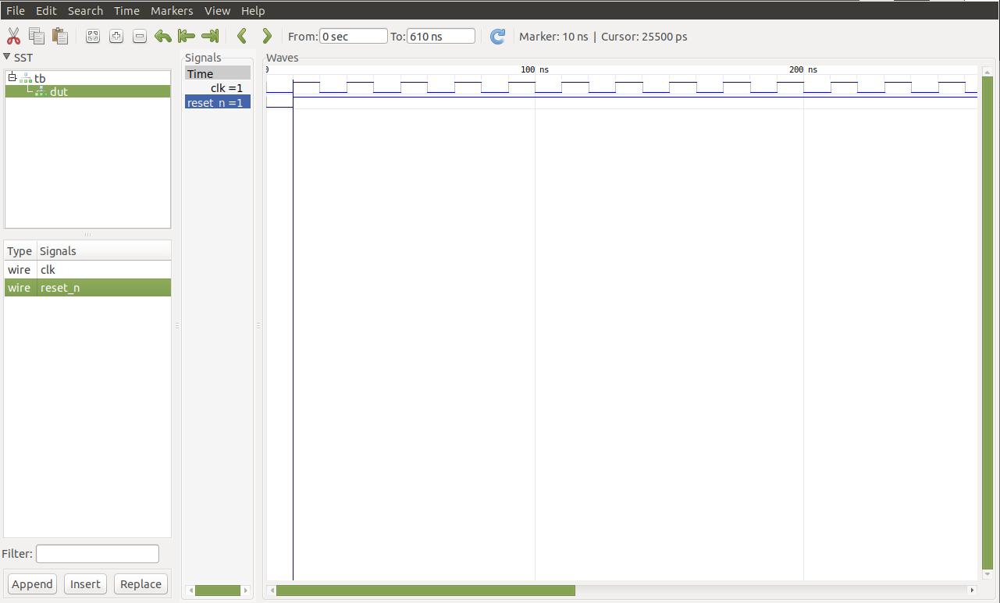

# BASIC Verilog and System Verilog Simulation Environment
## Using icarus verilog and gtkwave

### Components
tb.v : test bench stimuli

top.v: top level module

compile: compiles and runs simulation and launches gtk-wave with the output .vcd
### Requirements
Linux env

Icarus verilog compiler [apt-get install iverilog]

GTKWAVE [apt-get install gtkwave]

